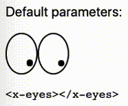

# X-Eyes Web Component

[
 
](https://www.npmjs.com/package/web-xeyes)
[](https://www.webcomponents.org/element/web-xeyes)

A [Web Component] showing a pair of eyes following movements of the mouse cursor on the page, like the [xeyes] from [X.Org] tools.

<!--
```
<custom-element-demo>
  <template>
    <script type=module src=https://unpkg.com/web-xeyes@1.0.2/dist/web-xeyes/web-xeyes.esm.js></script>
    <x-eyes></x-eyes>
  </template>
</custom-element-demo>
```
-->


See the [documentation of the x-eyes] component and the [on-line demo] or the [storybook].

## Contributing

In lieu of a formal styleguide, take care to maintain the existing coding style. Lint and test your code using `npm test`.

## License

Copyright (c) 2021-2023 Ferdinand Prantl

Licensed under the MIT license.

This project has started as a conversion of Felix Milea-Ciobanu's [jQuery xeyes] to pure JavaScript and a Web Component wrapper.

[X.Org]: https://www.x.org/
[xeyes]: https://wikipedia.org/wiki/Xeyes
[Web Component]: https://developer.mozilla.org/en-US/docs/Web/Web_Components
[documentation of the x-eyes]: ./src/components/x-eyes/#readme
[on-line demo]: https://prantlf.github.io/web-xeyes/
[storybook]: https://prantlf.github.io/web-xeyes/storybook/
[jQuery xeyes]: https://github.com/felixmc/jQuery-xeyes
