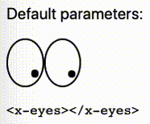

# X-Eyes Web Component

Shows a pair of eyes following movements of the mouse cursor on the page. A [WebComponent] showing the same picture as the [xeyes] tool from [X.Org] tools.

See the [documentation of the x-eyes] component.

## Contributing

In lieu of a formal styleguide, take care to maintain the existing coding style. Lint and test your code using `npm test`.

## License

Copyright (c) 2021 Ferdinand Prantl

Licensed under the MIT license.

[X.Org]: https://www.x.org/
[xeyes]: https://wikipedia.org/wiki/Xeyes
[WebComponent]: https://developer.mozilla.org/en-US/docs/Web/Web_Components
[documentation of the x-eyes]: ./src/components/x-eyes/#readme
